# Beyond Averages: Socio-Economic Profiles
**Original research figures · Python · K-Means · GMM · Data reasoning**

What population structure is hidden by overall averages? This project compares K-Means and Gaussian Mixture Models on male and female subsets of **48,842 Adult Income records**. Income is excluded from clustering and used afterwards to interpret the groups.

The figures below are extracted directly from the final analysis report. They are the original report outputs, not recreated illustrations. Report and notebook exports are separate artifacts; this page presents the report's figures and results.

## 1. Make model differences visible
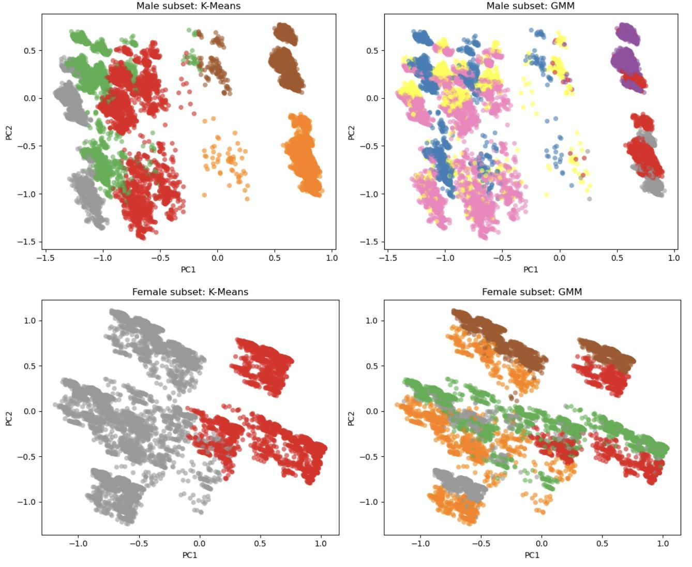

**Finding:** the selected solutions partition the same data differently. In the female subset, K-Means uses two broad groups while GMM uses five. The 2D views help explain this difference; they do not establish that either model is objectively superior or that groups are separated in the full feature space.

**Decision relevance:** compare whether a segmentation is detailed enough for the research question before turning it into a set of customer or population profiles.

## 2. Translate clusters into interpretable profiles
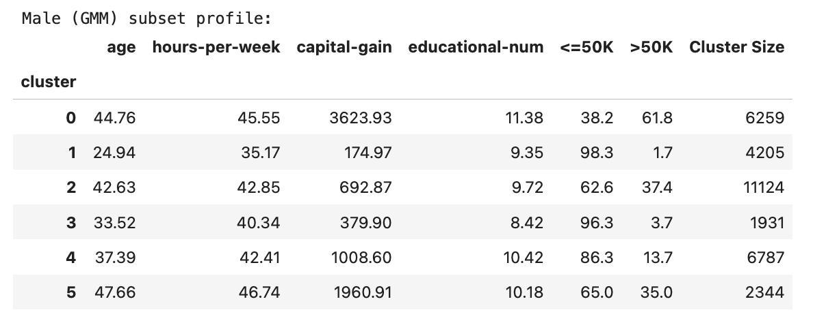
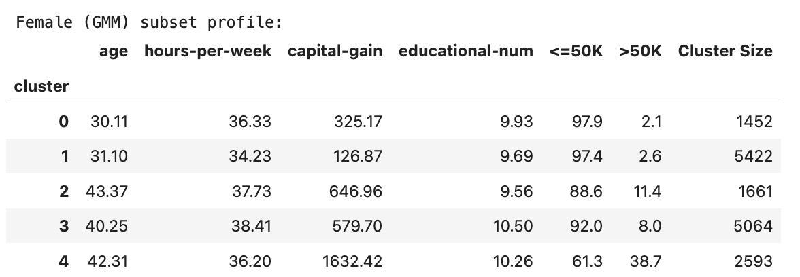

**Finding:** in the report, the share above 50K ranges from **1.7% to 61.8%** across male clusters and **2.1% to 38.7%** across female clusters. These are within-dataset cluster summaries, not causal effects or matched comparisons. Cluster identifiers are arbitrary and do not align across separately fitted models.

**Decision relevance:** profile tables turn a model label into understandable attributes and questions for further research. Potential uses include market-research sampling and service-design hypotheses; no commercial uplift was measured.

## 3. Show the evidence behind model selection
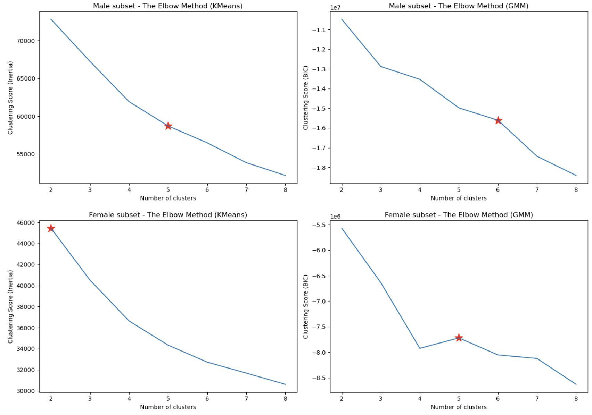
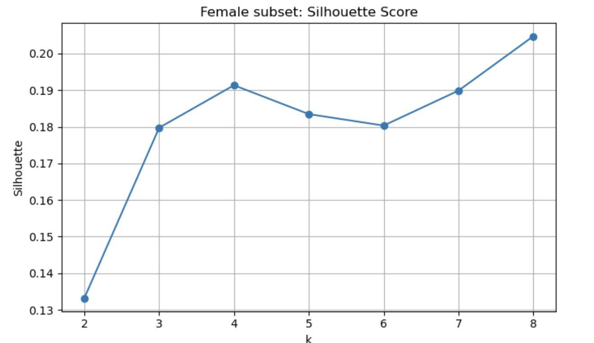

The report retained K-Means k=5 / k=2 and GMM k=6 / k=5 for male / female subsets. These were interpretive choices: the marked GMM values are **not the minimum BIC values shown**, and the silhouette curve does not uniquely support k=2. The original figure labels are preserved; the GMM panels plot BIC.

**Decision relevance:** explain the trade-off between statistical fit, complexity and interpretability instead of presenting a chosen segmentation as a uniquely optimal answer.

## 4. Understand segment size
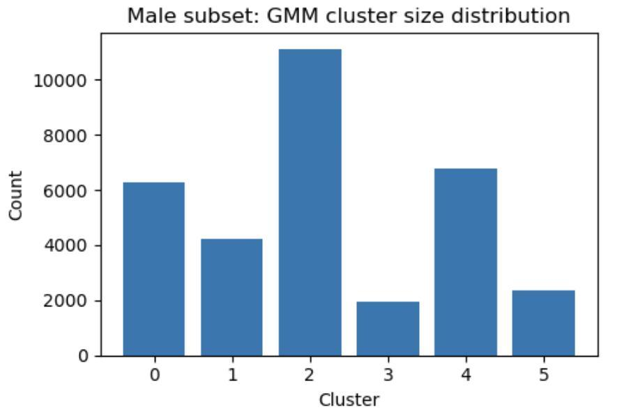
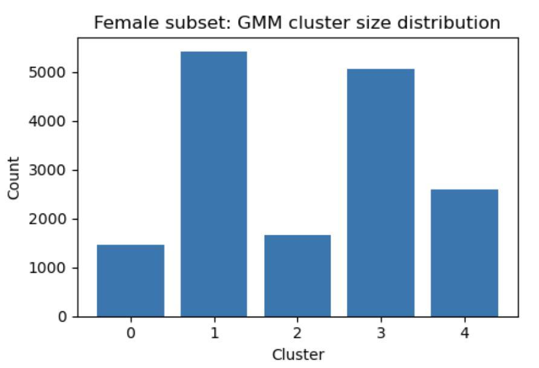

Cluster sizes vary substantially. Compare proportions when contrasting subsets of different total sizes. Sample counts are not estimates of current market size.

**Decision relevance:** consider both a profile's characteristics and its prevalence when deciding what to investigate next.

## 5. Check the structure in familiar variables
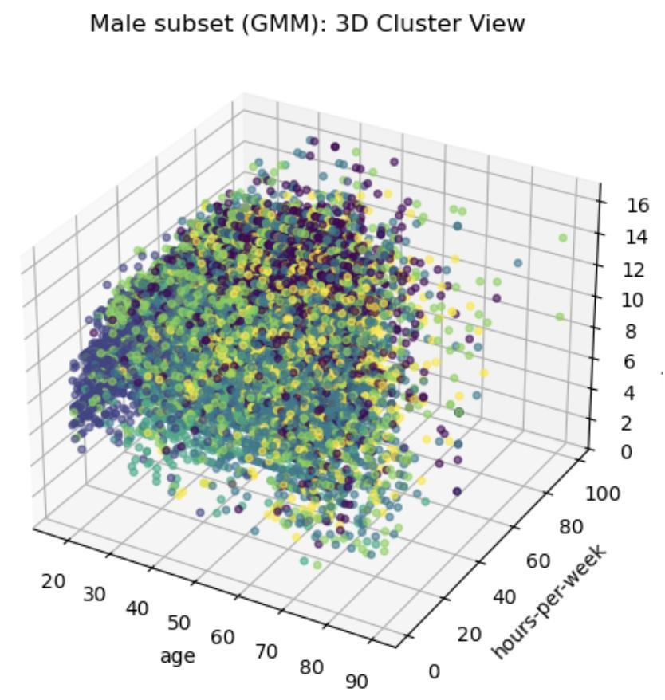
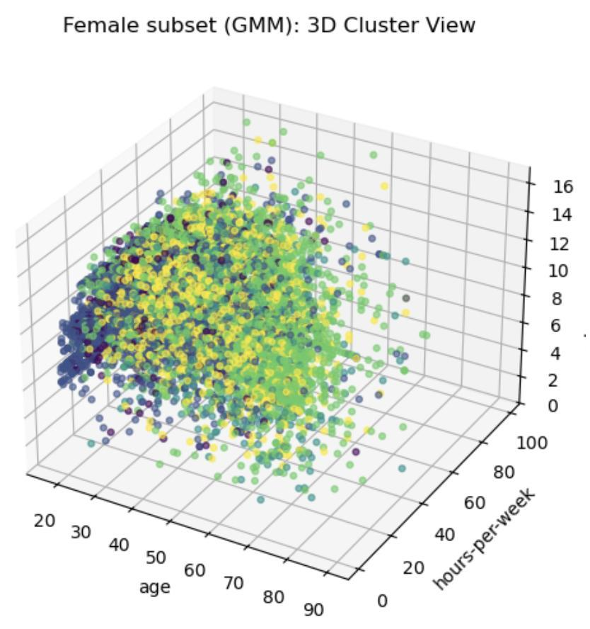

The original report uses age, weekly working hours and educational attainment. The overlapping clouds show why cluster labels should not be treated as rigid natural categories.

## 6. Data context
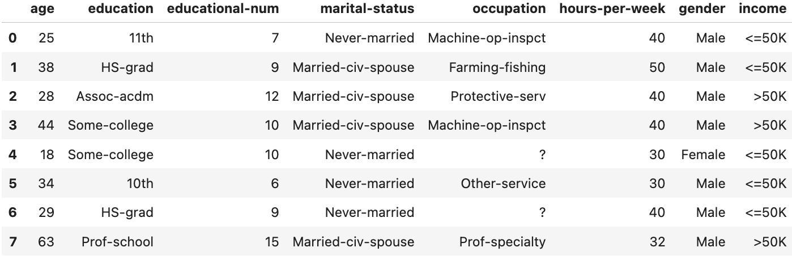
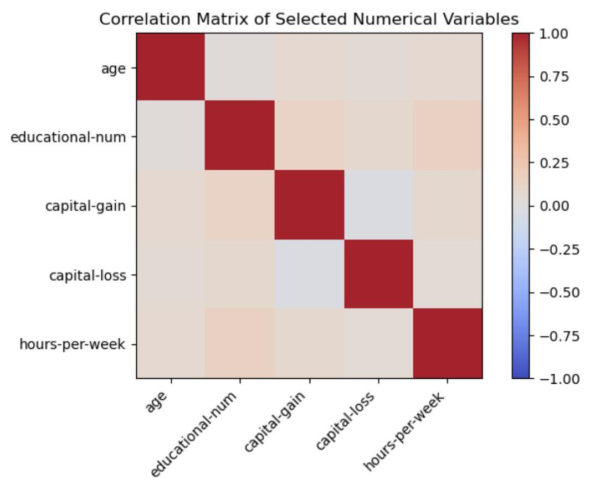

The selected numerical variables show mostly weak pairwise linear relationships. This alone does not establish independence, cluster validity or a causal relationship.

## Method and limits
- Missing values were imputed; categorical variables encoded and numerical variables scaled.
- Income was held out of model fitting; gender was used for stratification.
- The dataset's historical context, sampling and binary gender categories constrain interpretation.
- Results depend on preprocessing, model assumptions and the chosen number of clusters.
- Business applications described here are hypotheses for further validation.

## Supporting materials
[Submitted code notebook (PDF)](adult_income_gender_clustering_notebook.pdf) · [UCI Adult dataset](https://archive.ics.uci.edu/dataset/2/adult)

The notebook PDF is an existing code export, not a newly executed notebook. This gallery reproduces the final report's original images. Source: Yumeng Chen, *Gender-Stratified Unsupervised Discovery of Latent Socio-Economic Profiles in the Adult Income Dataset*, final report, March 2026.
